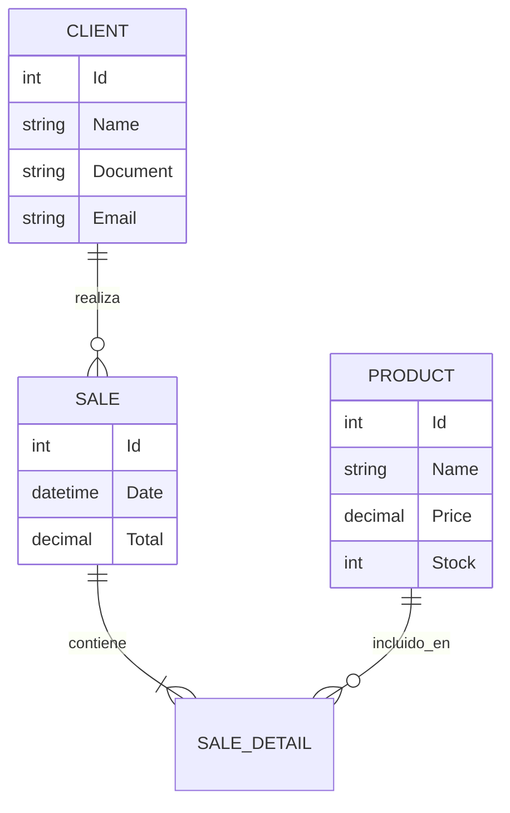

# 🏗️ Firmeza - Sistema de Gestión Administrativa

Sistema administrativo web desarrollado en **ASP.NET Core 8** para la gestión de venta de insumos de construcción y renta de vehículos industriales.

## 🚀 Características Principales

### Panel Administrativo (Razor Pages)
- **Dashboard Interactivo**: Métricas en tiempo real de ventas, productos y clientes.
- **Gestión de Inventario**: CRUD completo de productos con control de stock.
- **Gestión de Clientes**: Administración de base de datos de clientes.
- **Punto de Venta**: Registro de ventas y generación automática de **Recibos PDF**.
- **Importación Masiva**: Carga de datos desnormalizados desde Excel con normalización automática.
- **Exportación a Excel**: Descarga de productos, clientes y ventas en formato Excel.
- **Seguridad**: Sistema de roles (Administrador/Cliente) basado en ASP.NET Identity.

### API RESTful
- **Autenticación JWT**: Sistema de tokens para autenticación segura.
- **Endpoints CRUD**: Gestión completa de productos, clientes y ventas.
- **Documentación Swagger**: Documentación interactiva de la API.
- **Envío de Correos**: Notificaciones automáticas por email (SMTP).
- **Roles y Permisos**: Control de acceso basado en roles (Administrator, Client).
- **CORS Configurado**: Listo para integración con aplicaciones frontend.

### Portal Cliente (React SPA)
- **Autenticación Segura**: Login y registro con JWT.
- **Catálogo de Productos**: Visualización y búsqueda de productos disponibles.
- **Carrito de Compras**: Gestión completa del carrito con cálculo automático de totales.
- **Proceso de Compra**: Checkout con confirmación por email.
- **Diseño Responsive**: Interfaz moderna y adaptativa con TailwindCSS.
- **Experiencia Fluida**: SPA con React Router para navegación sin recargas.

## 🛠️ Tecnologías Utilizadas

- **Backend**: ASP.NET Core 8 (C#)
- **Base de Datos**: PostgreSQL (Npgsql)
- **ORM**: Entity Framework Core
- **Frontend**: Razor Pages, Bootstrap 5, FontAwesome
- **Librerías Clave**:
  - `EPPlus`: Procesamiento de Excel.
  - `QuestPDF`: Generación de documentos PDF.
  - `Identity`: Autenticación y Autorización.

## 📋 Requisitos Previos

- .NET SDK 8.0
- PostgreSQL 14+
- Docker (Opcional, para despliegue)

## ⚙️ Instalación y Ejecución (Local)

1. **Clonar el repositorio**
   ```bash
   git clone https://github.com/tu-usuario/firmeza-app.git
   cd firmeza-app
   ```

2. **Configurar Base de Datos**
   Actualiza la cadena de conexión en `Firmeza.Admin/appsettings.json`:
   ```json
   "ConnectionStrings": {
     "DefaultConnection": "Host=localhost;Database=FirmezaDB;Username=postgres;Password=tu_password"
   }
   ```

3. **Aplicar Migraciones**
   ```bash
   cd Firmeza.Admin
   dotnet ef database update
   ```

4. **Ejecutar la Aplicación**
   ```bash
   dotnet run
   ```
   El sistema creará automáticamente un usuario administrador:
   - **Email**: `admin@firmeza.com`
   - **Password**: `Admin@123`

## 🐳 Ejecución con Docker

1. Asegúrate de tener Docker Desktop corriendo.
2. Ejecuta el comando en la raíz de la solución:
   ```bash
   docker-compose up --build
   ```
3. Accede a los servicios:
   - **Panel Admin**: http://localhost:5000
   - **API**: http://localhost:5001
   - **Swagger**: http://localhost:5001

## 📐 Arquitectura y Diseño

### Diagrama Entidad-Relación (Simplificado)



## 🧪 Pruebas

El proyecto incluye pruebas unitarias para la lógica de negocio crítica.
Para ejecutarlas:
```bash
dotnet test
```

---
**Firmeza App** - Desarrollado para optimizar la gestión de materiales de construcción.
